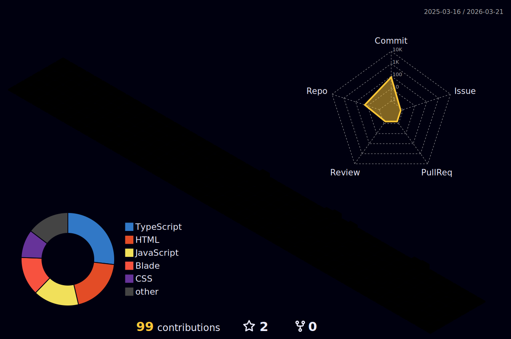

  

<!-- Terminal / About Me Section -->
<table align="center" border="0" cellpadding="0" cellspacing="0">
  <tr>
    <td width="600" valign="top">
      
<h3>👨‍💻 Terminal_WhoAmI</h3>
<pre>
<code class="language-bash">
> const user = {
    name: "Erlangga",
    role: "Full Stack Developer",
    location: "Indonesia 🇮🇩",
    hobby: ["Coding", "Designing", "Sleep 😴"],
    current_status: "Building Cool Stuff..."
};

> console.log("Let's Collaborate!");
</code>
</pre>

 
      
<!-- Typing SVG -->

   </td>
    <td width="400" valign="center">
      <!-- 3D Stats (Placeholder until Generated) -->
      

         
        
        
<i>(3D Stats will appear here after workflow run)</i>

      

    </td>
  </tr>
</table>

---

<!-- Stats Section -->
<h2 align="center">⚡ Github Stats ⚡</h2>

  <table border="0">
    <tr>
      <td>
        
      </td>
      <td>
         
      </td>
    </tr>
  </table>
   
  

 

<!-- Snake Game -->
<h2 align="center">🐍 Contributions Snake 🐍</h2>

  <picture>
    <source media="(prefers-color-scheme: dark)" srcset="https://raw.githubusercontent.com/xue-yuki/xue-yuki/output/github-snake-dark.svg">
    <source media="(prefers-color-scheme: light)" srcset="https://raw.githubusercontent.com/xue-yuki/xue-yuki/output/github-snake.svg">
    
  </picture>

---

<!-- Tech Stack -->
<h2 align="center">🛠️ Tech Arsenal</h2>

  <a href="https://skillicons.dev">
    
      
    
      
    
  </a>

 

<!-- Socials -->
<h2 align="center">🌐 Connect</h2>

     
     
  

 

  
   
  

